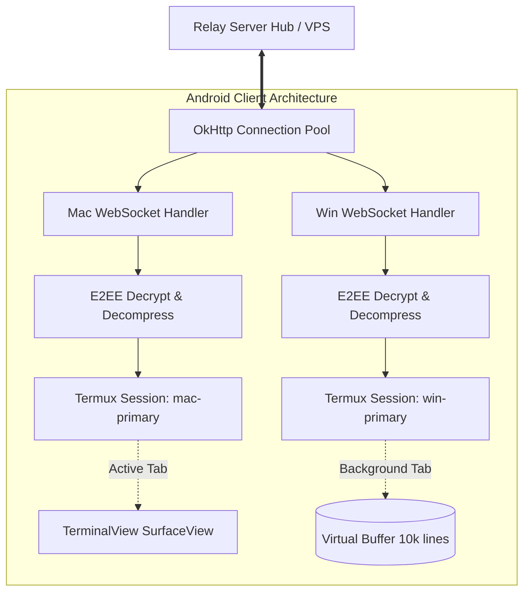

# Android Client App (`apps/android`) - Architecture & Technical Design Document
## Project: Terminal Mirror

---

### 1. Executive Summary & Mobile Platform Scope
The **Terminal Mirror Android Client** is a native, modern mobile application written in Kotlin, built with Jetpack Compose, and designed for Android 10 (API 29) through Android 14+ (API 34).

Its core mission is to provide an ultra-responsive, battery-efficient, and secure viewing experience for active workstation terminal sessions (macOS Darwin and Windows ConPTY) in real time over WiFi, cellular networks (4G/5G), and private mesh networks (ZeroTier).

Key engineering pillars:
1. **Zero-Lag Off-Thread Rendering**: Embedding Termux `terminal-view` via `AndroidView` backed by `SurfaceView` to isolate high-frequency ANSI terminal escape rendering from the Jetpack Compose UI recomposition cycle.
2. **Read-Only Safety First**: Default read-only lock to prevent accidental mobile touches, pocket typing, or gesture collisions from interrupting critical host development builds or production commands.
3. **Multi-Workstation Parallel Streaming**: Concurrent WebSocket subscriptions allowing seamless tab-switching between macOS (`zsh`) and Windows (`pwsh`) workstations without stream re-negotiation.
4. **Android Doze & Network Roaming Resilience**: An active `Foreground Service` coupled with a CPU `PARTIAL_WAKE_LOCK` and `ConnectivityManager.NetworkCallback` with exponential backoff and jitter.
5. **Hardware Keystore & Zero-Knowledge E2EE**: Hardware-backed key storage using `AndroidKeyStore` (`KeyMint` HAL v2 Curve25519 on Android 13+ / Tink fallback) and QR-code pairing via CameraX.

---

### 2. Mobile User Experience (UX) & Interaction Model

#### 2.1 Screen Anatomy & Visual Hierarchy
```
┌────────────────────────────────────────────────────────┐
│  Terminal Mirror                 🔒 [RO]  ⚡ [LIVE]  ⋮  │ <- TopAppBar
├─────────────────────────┬──────────────────────────────┤
│  💻 MacBook Pro (zsh)   │  🪟 ThinkPad Win (pwsh)     │ <- Workstation Tabs
├─────────────────────────┴──────────────────────────────┤
│                                                        │
│  $ cargo test --workspace                              │
│     Compiling terminal-mirror v0.1.0                   │
│     Finished `test` profile [unoptimized + debuginfo]  │
│     Running unittests src/main.rs                      │
│     test result: ok. 15 passed; 0 failed               │
│                                                        │
│  [Hardware SurfaceView / Termux TerminalView]          │
│                                                        │
├────────────────────────────────────────────────────────┤
│ [ESC] [TAB] [CTRL] [ALT] [ | ] [ ~ ] [ ↑ ] [ ↓ ] [ ← ] │ <- Accessory Bar
└────────────────────────────────────────────────────────┘
```

#### 2.2 Safety Mode (Read-Only Default)
Mobile screens are inherently prone to false touches, swipe misinterpretations, and pocket activation. Sending unintended control characters (`Ctrl+C`, `Enter`) to an active terminal could kill a running database migration, deploy script, or training job.
- **Default State**: All mirrored sessions launch in **LOCKED (Read-Only)** mode. Touch events over the terminal canvas are captured purely for viewport navigation (scrolling, zooming, text inspection).
- **Unlock Toggle**: Tapping the top-right Lock icon transitions to **INTERACTIVE** mode:
  - Unhides the Programmer Accessory Bar.
  - Enables the Android software keyboard (IME).
  - Routes raw keystrokes and escape sequences through the E2EE WebSocket upstream to the host.

#### 2.3 Programmer Accessory Bar
Modern mobile keyboards lack developer keys. When unlocked, the bottom accessory bar provides single-tap access to:
- Control modifiers: `ESC`, `TAB`, `CTRL`, `ALT`
- Shell operators: Pipe (`|`), Tilde (`~`), Backtick (`` ` ``), Underscore (`_`), Hyphen (`-`)
- Cursor navigation: `↑` (History prev), `↓` (History next), `←`, `→`
- Emergency Kill Switch button: Instantly sends `Ctrl + Shift + Q` or disconnects the remote session.

#### 2.4 Touch Gestures & Viewport Navigation
- **Pinch-to-Zoom**: Dynamically adjusts terminal font scale between 8 pt and 28 pt without requesting host PTY resizing.
- **Double-Tap**: Resets font size to default (12 pt) and centers active cursor.
- **Two-Finger Vertical Drag**: Scrolls the 10,000-line virtual scrollback buffer.
- **Long Press & Drag**: Activates native Android text selection modal with "Copy", "Share", and "Web Search".

---

### 3. Rendering Engine Architecture: SurfaceView + Termux `terminal-view`

#### 3.1 Why Compose Canvas is Unsuitable for Terminal Output
Jetpack Compose's declarative UI model is optimal for standard Android screens. However, terminal rendering receives dozens of ANSI stream fragments per second containing cursor positioning, 256-color escape codes, and UTF-8 multi-byte glyphs.
Triggering Compose recompositions at this frequency causes frame drops, GC pressure, and UI jank.

#### 3.2 Hybrid Architecture: `AndroidView` Bridge
Terminal Mirror adopts the proven architecture used by high-performance Android terminal emulators (Termux, NyaMux):
```
┌─────────────────────────────────────────────────────────────────┐
│                     Jetpack Compose Hierarchy                   │
│  • Scaffold, TopAppBar, TabRow, Workstation Switcher            │
│  • Accessory Bar, Settings Sheet, Biometric Lock Dialog         │
├─────────────────────────────────────────────────────────────────┤
│                               ▼                                 │
│        AndroidView(factory = { TerminalView(context) })         │
├─────────────────────────────────────────────────────────────────┤
│                     Termux Terminal Subsystem                   │
│  • TerminalView: SurfaceView subclass with dedicated draw thread│
│  • TerminalSession: Manages vt100 virtual grid & cursor state   │
│  • TerminalRenderer: Hardware-accelerated text & color rendering│
└─────────────────────────────────────────────────────────────────┘
```

#### 3.3 TerminalView Integration Spec
```kotlin
@Composable
fun HardwareTerminalCanvas(
    terminalSession: TerminalSession,
    isReadOnly: Boolean,
    modifier: Modifier = Modifier
) {
    AndroidView(
        factory = { context ->
            TerminalView(context, null).apply {
                attachSession(terminalSession)
                setTextSize(12.spToPx(context))
                setTerminalViewClient(object : TerminalViewClient {
                    override fun onScale(scale: Float): Float = scale
                    override fun onSingleTapUp(e: MotionEvent) {
                        if (!isReadOnly) requestFocus()
                    }
                    override fun shouldRuntimeClose(): Boolean = false
                })
            }
        },
        update = { view ->
            if (view.currentSession != terminalSession) {
                view.attachSession(terminalSession)
            }
        },
        modifier = modifier.fillMaxSize()
    )
}
```

---

### 4. Multi-Workstation Parallel Streaming Architecture

#### 4.1 Concurrent Session Management
When a developer has both a macOS workstation and a Windows workstation active, the Android app maintains **two distinct background WebSocket subscriptions** within a unified connection pool.



- **Active Tab**: Directly piped to the hardware `TerminalView` on screen.
- **Background Tab**: Continues receiving deltas in background; updates its virtual `TerminalSession` buffer in memory without dropping packets. Switching tabs is instantaneous (< 16 ms) with zero reconnection latency.

---

### 5. Android Lifecycle, Doze Mode & Network Roaming Hardening

#### 5.1 The Mobile Background Killing Threat
Android's Doze Mode and aggressive OEM battery optimizations (Xiaomi MIUI, Samsung OneUI, OnePlus OxygenOS) terminate background WebSocket connections within minutes.

#### 5.2 Foreground Service & CPU WakeLock
The app runs `TerminalMirrorService`:
- **Notification**: High-priority `Ongoing` notification displaying connected host count and streaming throughput.
- **WakeLock**: `PowerManager.PARTIAL_WAKE_LOCK` held while at least one workstation stream is active.
- **JobScheduler / WorkManager**: Fallback synchronization worker if service is ever killed by extreme OS memory pressure.

#### 5.3 Network Roaming & Reconnection State Machine
When switching from Home WiFi to Cellular 5G or entering an elevator:
1. `ConnectivityManager.NetworkCallback` detects network drop (`onLost`).
2. Immediate transition of UI indicator to `[RECONNECTING...]` without clearing the terminal screen.
3. Exponential Backoff with Jitter:
   $$T_{\text{wait}} = \min(30000, 500 \times 2^n) + \text{random}(0, 1000) \text{ ms}$$
4. Upon network restoration (`onAvailable`), the client re-establishes WebSocket tunnel and sends `SubscribeSession(last_sequence)`.
5. If sequence gap is detected, Relay/Host dispatches a `ScreenStateSync` snapshot, restoring visual state without terminal artifact distortion.

---

### 6. Hardware Keystore & Zero-Knowledge E2EE Architecture

#### 6.1 Cryptographic Storage Hierarchy
```
┌─────────────────────────────────────────────────────────────┐
│                    Android Keystore Provider                │
│  • Android 13+ (API 33+): Native KeyMint HAL v2             │
│    - Algorithm: "Ed25519" (Signing) & "XDH" (X25519)       │
│  • Android 10-12 (API 29-32): Hardware AES-256 GCM Key     │
│    - Encrypts local Ed25519 seed stored in Jetpack Security │
│      EncryptedSharedPreferences                             │
└─────────────────────────────────────────────────────────────┘
```

#### 6.2 QR-Code Pairing Flow
1. Developer runs `terminal-mirror-mac` or `terminal-mirror-windows` on workstation.
2. Workstation generates an ephemeral 4-word Diceware passphrase and renders a pairing QR Code.
3. Android user opens CameraX scanner in app and points at workstation terminal.
4. QR payload contains:
   `{"host_id": "macbook-pro", "relay_url": "wss://...", "pubkey": "base64...", "pin": "..."}`
5. Mobile generates its own ephemeral key pair, performs X25519 ECDH key exchange, and stores the authorized host public key in secure hardware storage.

---

### 7. Modular Android Codebase Structure (`apps/android/`)

```
apps/android/
├── app/
│   ├── build.gradle.kts
│   └── src/
│       └── main/
│           ├── AndroidManifest.xml
│           ├── java/com/mufid/terminalmirror/
│           │   ├── MainActivity.kt               # Single Activity entrypoint
│           │   ├── crypto/
│           │   │   ├── KeystoreManager.kt        # Android Keystore & KeyMint wrapper
│           │   │   ├── E2eeEngine.kt             # ChaCha20-Poly1305 + Zstd pipeline
│           │   │   └── PairingManager.kt         # QR code parsing & Diceware validation
│           │   ├── model/
│           │   │   ├── Models.kt                 # TerminalSession, OsType, Packet
│           │   │   └── WorkstationConfig.kt      # Saved paired workstation profiles
│           │   ├── network/
│           │   │   ├── RelayClient.kt            # OkHttp WebSocket client
│           │   │   ├── ConnectionManager.kt      # Multi-session connection pooling
│           │   │   └── NetworkCallbackHandler.kt # Network roaming & Doze resilience
│           │   ├── service/
│           │   │   └── TerminalMirrorService.kt  # Foreground Service & WakeLock
│           │   ├── terminal/
│           │   │   ├── TermuxBridge.kt           # SurfaceView TerminalView wrapper
│           │   │   └── SessionRegistry.kt        # In-memory virtual terminal sessions
│           │   └── ui/
│           │       ├── components/
│           │       │   ├── AccessoryBar.kt       # Programmer keyboard row
│           │       │   ├── StatusHeader.kt       # Lock / live streaming indicators
│           │       │   └── WorkstationTabs.kt    # Swipeable session tabs
│           │       ├── scanner/
│           │       │   └── QrScannerScreen.kt    # CameraX QR pairing view
│           │       └── theme/
│           │           ├── Color.kt              # Dark terminal color palette
│           │           └── Theme.kt              # Material 3 dark theme
```
