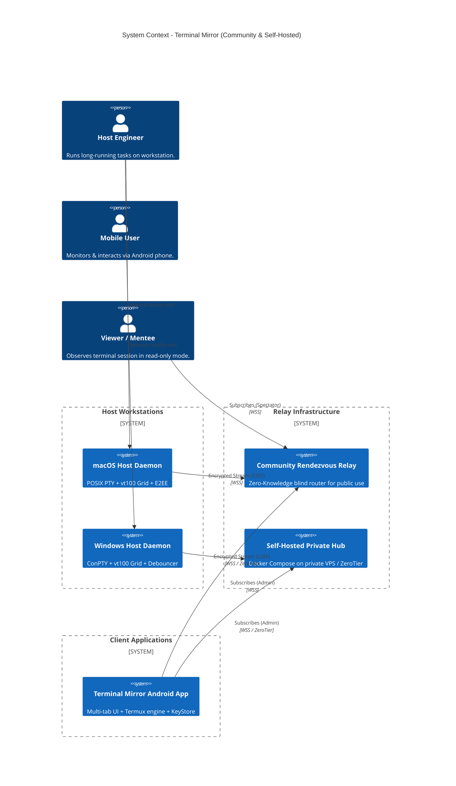
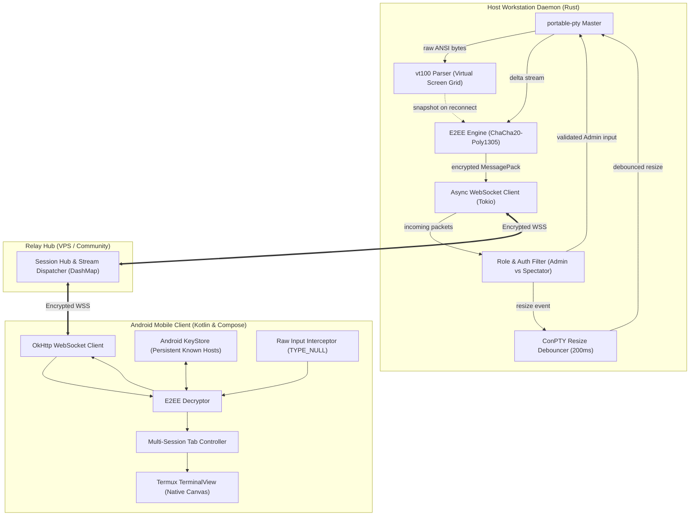
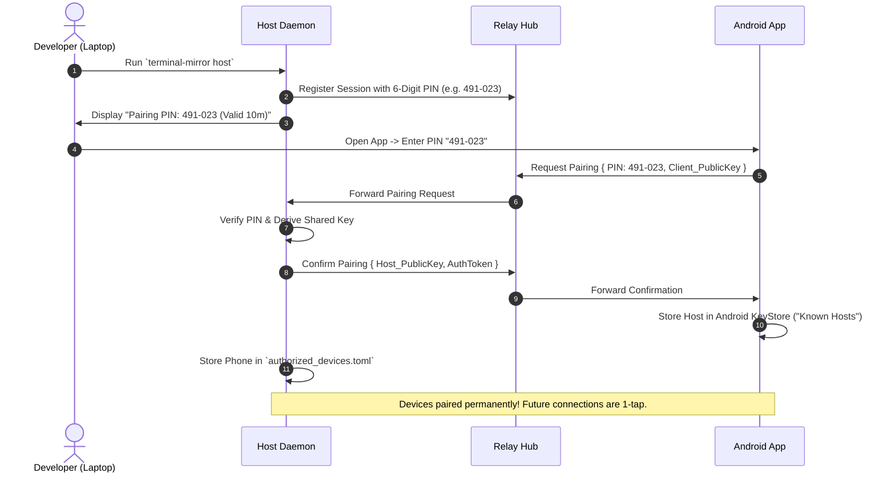
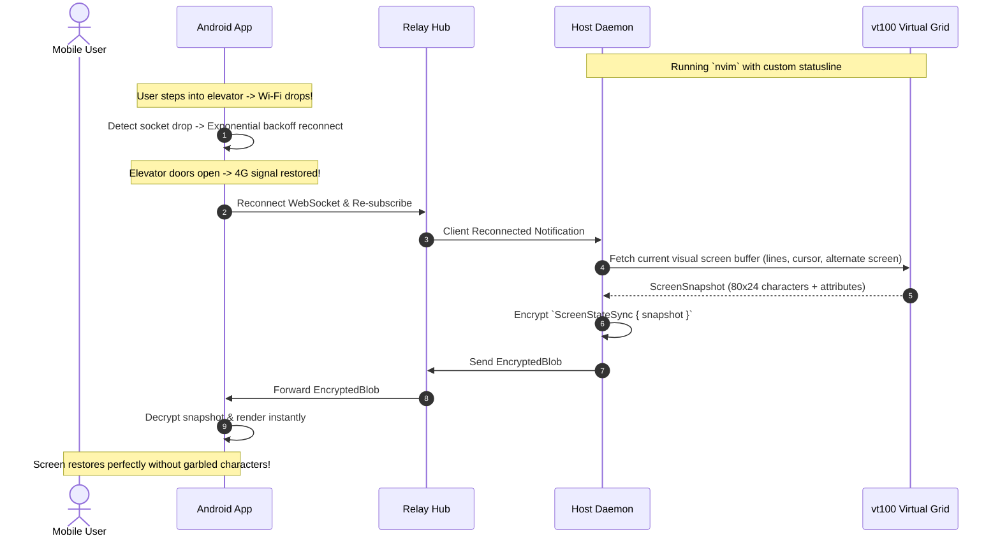

# Architecture & Design Specifications
## Project: Terminal Mirror (Open-Source Edition)

---

### 1. High-Level System Architecture

---

### 2. Internal Container Architecture & Virtual Grid Engine

---

### 3. Sequence Diagrams

#### 3.1 Headless PIN Pairing Handshake

#### 3.2 Seamless Roaming & Screen Snapshot Resync

