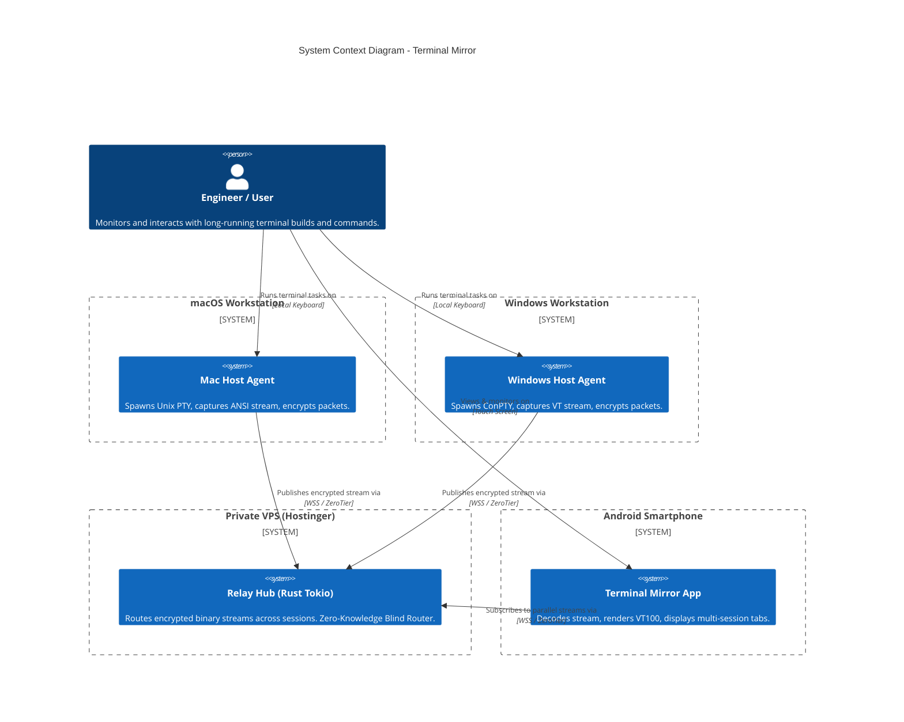
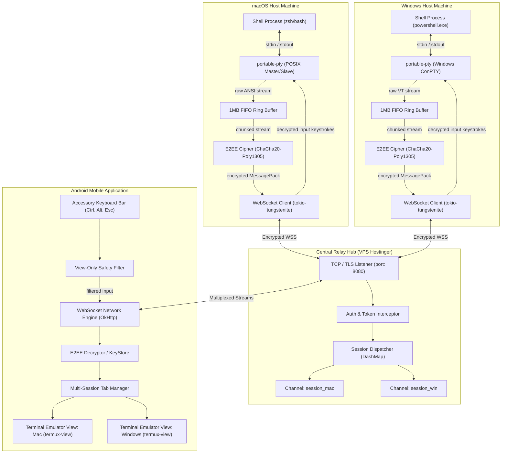
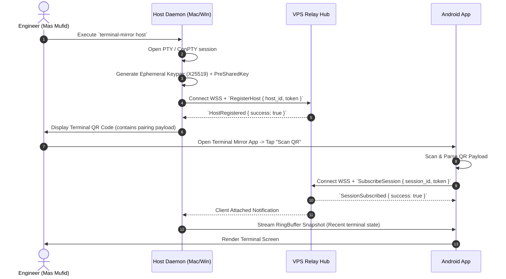
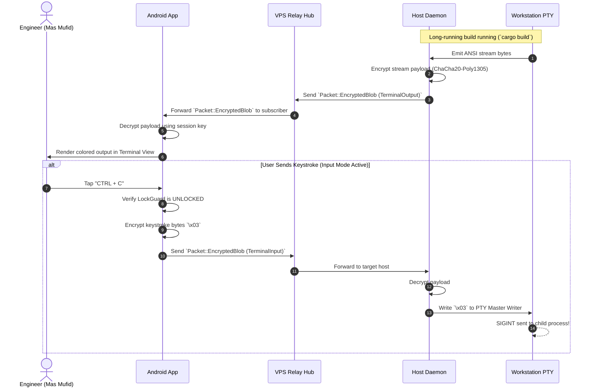
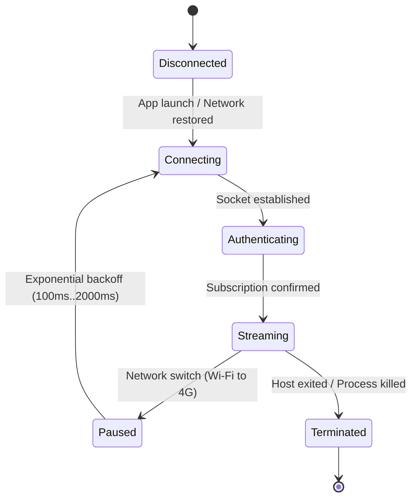

# Architecture & Design Specifications
## Project: Terminal Mirror

---

### 1. System Context & Overview (C4 Context Diagram)

The following diagram illustrates the boundaries and actors interacting with the Terminal Mirror ecosystem:

---

### 2. Container Architecture (C4 Container Diagram)

Detailed view of the internal software modules across Host, Server, and Mobile:

---

### 3. End-to-End Sequence Diagrams

#### 3.1 Host Registration and QR Code Pairing

#### 3.2 Real-Time Streaming and Input Flow

---

### 4. Resiliency & Network Reconnection State Machine

