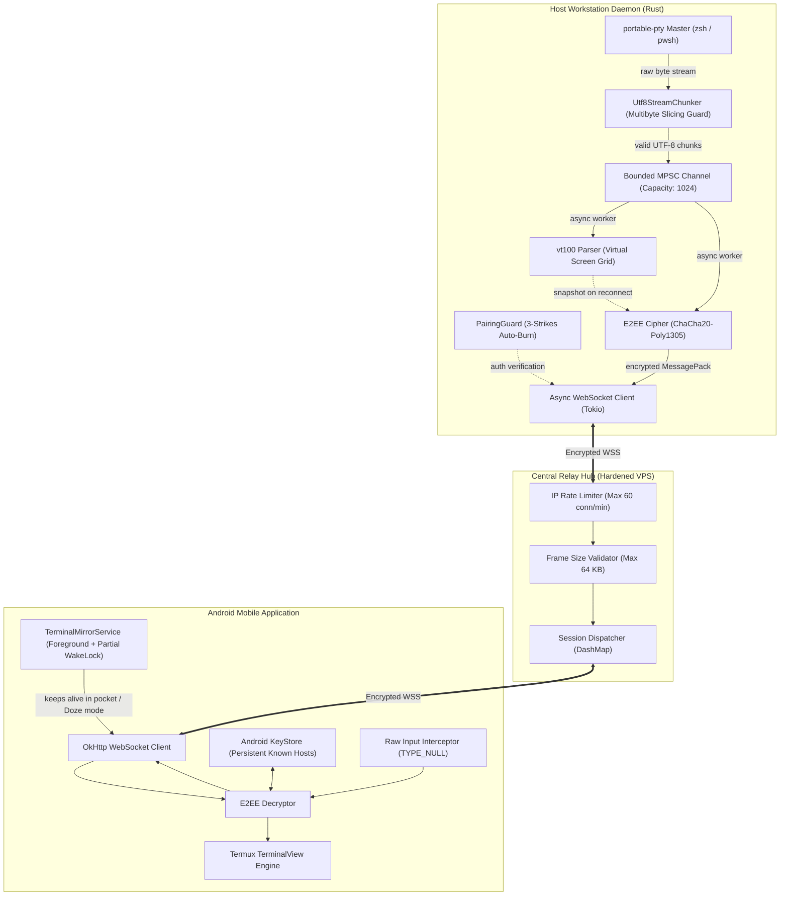
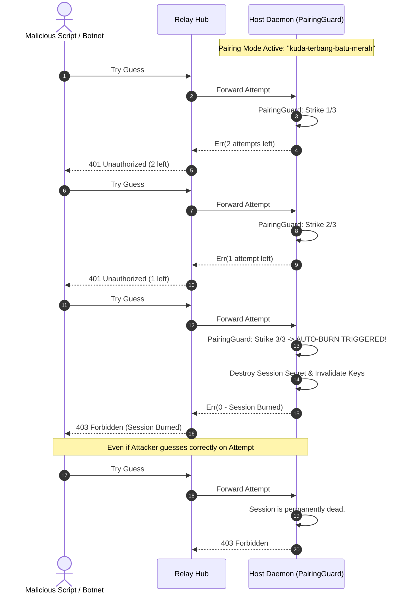

# Architecture & Design Specifications
## Project: Terminal Mirror (Hardened Open-Source Edition)

---

### 1. Hardened System Architecture Diagram

---

### 2. Sequence Diagram: 3-Strike Auto-Burn Defense

