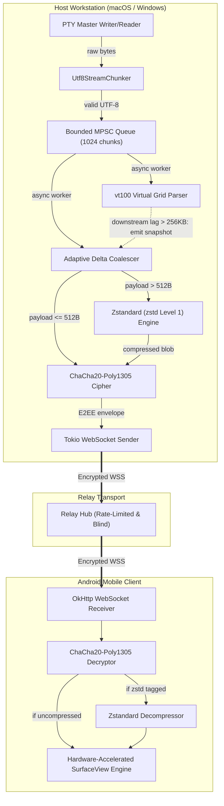
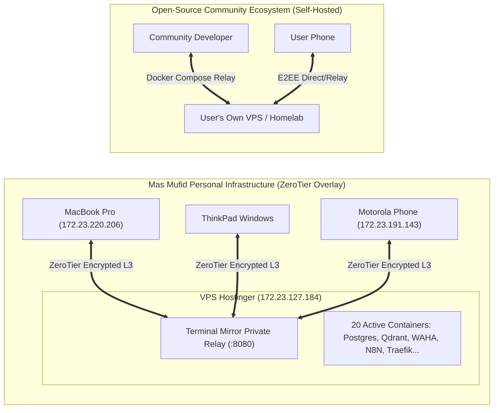

# Architecture & Design Specifications
## Project: Terminal Mirror (Hardened Open-Source & Performance Edition)

---

### 1. Performance Pipeline & Backpressure Flow

---

### 2. Infrastructure Deployment Isolation (Zero-Contention Topology)

