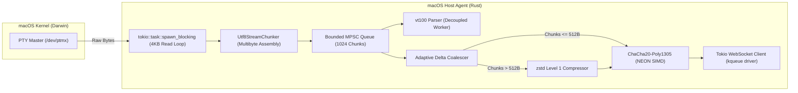

# macOS Terminal Host Agent (`apps/mac`) - Architecture & Technical Design Document
## Project: Terminal Mirror

---

### 1. Executive Summary & Vision
The **macOS Terminal Host Agent** is a native, high-performance background daemon and CLI wrapper written in Rust, tailored specifically for macOS (Apple Silicon M-Series and Intel x86_64). 

Its primary responsibility is to attach to or spawn an interactive login shell (defaulting to `/bin/zsh`), capture full-fidelity ANSI/VT100 streams, maintain an in-memory virtual screen grid, encrypt payloads using hardware-accelerated ChaCha20-Poly1305, and transmit compressed streams over a WebSocket tunnel to the Relay Hub.

---

### 2. Dual User Experience (UX) Modes on macOS

#### Mode 1: Interactive Terminal Wrapper (Developer Default)
* Executed directly in any terminal emulator (Terminal.app, iTerm2, Alacritty, Ghostty, WezTerm):
  ```bash
  terminal-mirror
  ```
* Spawns the user's default login shell inside an isolated PTY master/slave pair.
* Displays a compact 3-line ambient status header at startup:
  ```text
  ┌──────────────────────────────────────────────────────────────┐
  │  Terminal Mirror (macOS M-Series) - E2EE Active              │
  │  Pairing Passphrase : [ kuda-terbang-batu-merah ]            │
  │  Kill Switch : Ctrl + Shift + Q | Status: Waiting for Client │
  └──────────────────────────────────────────────────────────────┘
  ```
* When an Android client attaches, the header updates non-intrusively to:
  `[ ● 1 Mobile Viewer Connected | View-Only Mode ]`.

#### Mode 2: Native macOS Menu Bar Daemon (Background Headless)
* Executed as a standalone background utility:
  ```bash
  terminal-mirror --menu-bar
  ```
* Registers an `NSStatusItem` in the macOS top Menu Bar with a sleek terminal icon.
* **Menu Bar Actions**:
  * Active Session Status: `MacBook Pro (zsh) - Streaming`
  * "Show Pairing QR Code" (Pops up a floating macOS HUD window)
  * "Copy Pairing Passphrase" (Copies `word-word-word-word` to macOS Clipboard)
  * "Connected Devices" (Lists paired Android phones with revocation buttons)
  * "Instant Kill Switch" (`Cmd + Shift + K` or `Ctrl + Shift + Q`)

---

### 3. macOS Darwin PTY Subsystem Deep Dive

#### 3.1 Kernel Device Allocation (`/dev/ptmx`)
macOS uses the BSD/Darwin PTY subsystem. Under the hood, `portable-pty` interacts with `/dev/ptmx` via `openpty()`, returning:
* `master_fd`: Controlled by the Host Agent for stream read/write and window control.
* `slave_fd`: Attached to the child login shell (`stdin`, `stdout`, `stderr`).

#### 3.2 Login Shell Execution Semantics
On macOS, user configurations, Homebrew binaries (`/opt/homebrew/bin`), and custom aliases are defined in login scripts (`.zprofile`, `.zshrc`). Spawning a bare `/bin/zsh` produces an incomplete environment.
* The macOS Host Agent explicitly queries directory services or `$SHELL`:
  ```rust
  let user_shell = std::env::var("SHELL").unwrap_or_else(|_| "/bin/zsh".to_string());
  let mut cmd = CommandBuilder::new(user_shell);
  cmd.args(["-l"]); // MUST pass -l to trigger login shell sourcing
  ```
* Environment propagation: The agent exports `TERM=xterm-256color`, `COLORTERM=truecolor`, and `TERMINAL_MIRROR_ACTIVE=1`.

#### 3.3 Terminal Control Settings (`termios`) & Signals
* The slave PTY is set to raw mode (`cfmakeraw` equivalent) so interactive applications (`vim`, `nvim`, `tmux`, `fzf`) receive key combinations and escape codes untampered.
* **`SIGWINCH` Handling**: When the terminal window resizes locally, Darwin kernel sends `SIGWINCH` to the foreground process group. The macOS Host Agent listens for `tokio::signal::unix::SignalKind::window_change()` and propagates changes upstream.

---

### 4. macOS Power Management & Clamshell Lifecycle

MacBooks frequently transition into sleep mode when the lid is closed (clamshell sleep) or when idle.

#### 4.1 Sleep / Wake Detection Architecture
The macOS Host Agent registers observers with the **I/O Kit Power Management** subsystem:
* **Sleep Event (`kIOMessageSystemWillSleep`)**:
  1. The agent intercepts the impending sleep message.
  2. Dispatches a clean `PacketPayload::SessionRevoked { reason: "macOS entered sleep mode" }` or pause packet to the Relay Hub.
  3. Gracefully closes the active WebSocket connection.
* **Wake Event (`kIOMessageSystemHasPoweredOn`)**:
  1. Network interfaces re-acquire IP addresses.
  2. The agent automatically initiates reconnection to the Relay Hub with exponential backoff.
  3. Takes a fresh snapshot from its internal `vt100` virtual screen grid.
  4. Pushes `ScreenStateSync` to the mobile client as soon as it re-attaches.

---

### 5. High-Throughput Apple Silicon (ARM64) Streaming Pipeline



* **Zero-Copy Memory**: Uses `bytes::Bytes` to prevent memory allocation overhead across threads.
* **NEON SIMD Vectorization**: The `ring` cryptography engine automatically leverages ARMv8 NEON SIMD instructions on M1/M2/M3/M4 chips for ultra-fast AEAD encryption with near-zero CPU footprint.
* **`kqueue` Event Demultiplexing**: The Tokio runtime on macOS uses the native BSD `kqueue` syscall, delivering microsecond I/O responsiveness.

---

### 6. Security, Keychain & TCC Permissions on macOS

* **Persistent Credential Storage**: Authorized client public keys and long-lived session signing keys are stored securely in the **macOS Keychain** using Apple's `Security.framework` API (via `security-framework` crate).
* **TCC (Transparency, Consent, and Control)**:
  * When running in CLI mode, the tool inherits Terminal.app / iTerm2's existing permissions.
  * When running as a standalone `.app` bundle, it requires no elevated Accessibility or Input Monitoring permissions because it exclusively reads and writes to its own allocated child PTY, respecting standard UNIX process boundaries.

---

### 7. Modular Codebase Structure (`apps/mac/src/`)

```
apps/mac/
├── Cargo.toml
├── src/
│   ├── main.rs               # Entrypoint & CLI dispatch
│   ├── config.rs             # Configuration & environment variables
│   ├── pty/
│   │   ├── mod.rs            # PTY abstraction module
│   │   ├── darwin.rs         # Darwin /dev/ptmx & termios configuration
│   │   └── shell_spawner.rs  # Login shell resolution (/bin/zsh -l)
│   ├── stream/
│   │   ├── mod.rs
│   │   ├── decoupled_queue.rs# Bounded MPSC stream queue
│   │   ├── coalescer.rs      # Adaptive delta coalescing
│   │   └── compressor.rs     # zstd Level 1 compression wrapper
│   ├── power/
│   │   ├── mod.rs
│   │   └── sleep_listener.rs # IOKit sleep/wake notification handler
│   ├── security/
│   │   ├── mod.rs
│   │   ├── keychain.rs       # macOS Keychain integration
│   │   └── kill_switch.rs    # Ctrl+Shift+Q hotkey interceptor
│   └── ui/
│       ├── mod.rs
│       ├── banner.rs         # Terminal ASCII banner & QR Code renderer
│       └── menu_bar.rs       # Optional NSStatusItem Menu Bar integration
```

---

### 8. Packaging & Distribution for macOS
* **Universal 2 Binary**: Compiled for both `aarch64-apple-darwin` (Apple Silicon) and `x86_64-apple-darwin` (Intel) using `cargo build --target ...` and merged via `lipo`:
  ```bash
  lipo -create -output terminal-mirror \
    target/aarch64-apple-darwin/release/terminal-mirror-mac \
    target/x86_64-apple-darwin/release/terminal-mirror-mac
  ```
* **Homebrew Formula**: Packaged for 1-line installation:
  ```bash
  brew install mufidhadi/tap/terminal-mirror
  ```
* **Gatekeeper & Apple Notarization**: Signed with Developer ID Application certificate and notarized via `xcrun notarytool`.
