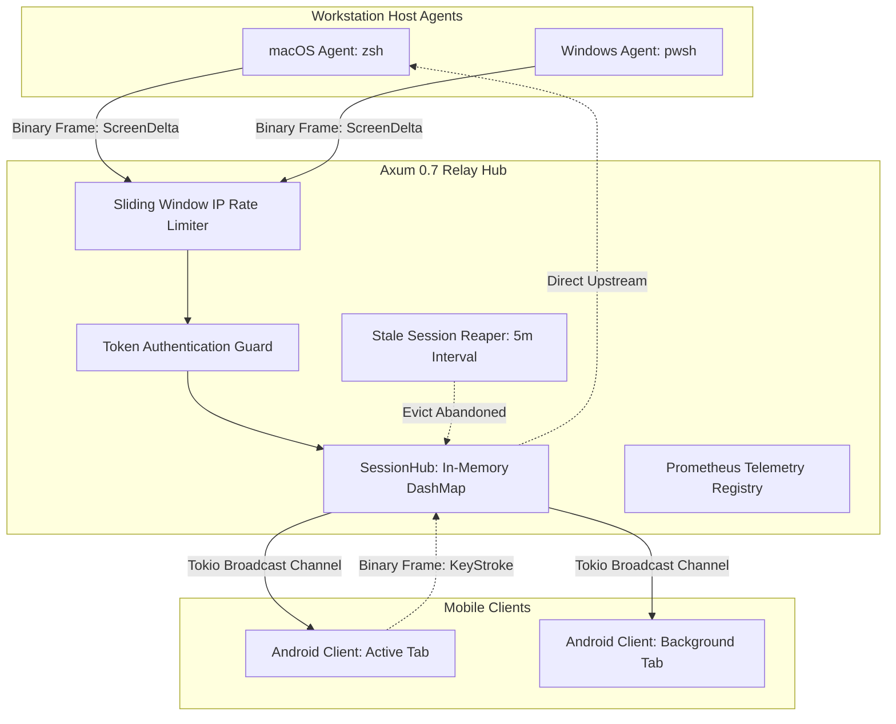

# Relay Server Hub (`services/relay-server`) - Architecture & Technical Design Document
## Project: Terminal Mirror

---

### 1. Executive Summary & System Role
The **Terminal Mirror Relay Server Hub** is a high-performance, asynchronous WebSocket message broker written in Rust using the **Axum 0.7** framework and the **Tokio** runtime.

Its primary mission is to connect distributed Host Agents (macOS Darwin and Windows ConPTY) with Mobile Subscribers (Android Client) across heterogeneous network topologies (LAN, WAN, 4G/5G mobile, and private mesh networks such as ZeroTier).

Crucially, the Relay Server operates in a **Zero-Knowledge Blind Routing Mode**:
- It **never** receives or stores E2EE encryption keys (ChaCha20-Poly1305).
- It **never** decrypts or inspects terminal screen contents.
- It treats all incoming payloads as opaque, versioned binary MessagePack frames (`Packet`).
- It routes frames between authenticated hosts and paired subscribers with sub-millisecond in-memory dispatch.

---

### 2. Live VPS Environment & Production Constraints

#### 2.1 VPS Specification & Production Workload Audit
The private relay server is deployed on mas mufid's central Hostinger VPS (`172.23.127.184` via ZeroTier):
- **CPU**: AMD EPYC 9354P Zen 4 (2 vCPUs)
- **RAM**: 7.8 GiB (5.2 GiB available)
- **Active Colocated Workload**: Running **20 active production Docker containers**, including PostgreSQL, Qdrant Vector DB, WAHA (WhatsApp HTTP API), N8N Workflows, Traefik Reverse Proxy, and audit dashboard services.
- **Monthly Bandwidth Quota**: 8,000 GB (8 TB).
  > [!WARNING] Hostinger Quota Policy
  > If monthly outbound traffic exceeds the 8 TB threshold, Hostinger automatically throttles the VPS connection speed to **10 Mbps**. Such throttling would cripple production WhatsApp bots, vector search, and web services.

#### 2.2 Dual-Track Deployment Strategy
To guarantee server health, prevent abuse, and uphold open-source principles:
1. **Private Production Hub (Mas Mufid Personal)**:
   - Bound to ZeroTier private IP `172.23.127.184` and `masmuf.cloud` domain behind Traefik reverse proxy.
   - Protected by a strong shared `RELAY_AUTH_TOKEN`.
   - Access restricted to mas mufid's registered devices (laptop, ThinkPad, Motorola smartphone).
2. **Open-Source Community Track ("Self-Host First")**:
   - The project does **NOT** run a public, unauthenticated open community relay on the private VPS.
   - Community users are provided with a lightweight, 1-click `docker-compose.yml` with strict resource caps (`cpus: 0.5`, `memory: 256M`), enabling deployment on any $3–$5 VPS or home server in under 60 seconds.

---

### 3. Core Architecture & Routing Subsystem



#### 3.1 Zero-Knowledge SessionHub
The central state is managed by `SessionHub`, wrapping an in-memory `DashMap<String, SessionRouter>`:
- **`host_tx`**: `mpsc::Sender<Vec<u8>>` directed upstream to the Host Agent (for handling incoming keystrokes and resize signals from mobile clients).
- **`broadcast_tx`**: `tokio::sync::broadcast::Sender<Vec<u8>>` with a bounded ring buffer of **1024 frames** directed downstream to all connected subscribers.
- **`subscribers_count`**: Atomic counter tracking active mobile viewers per session.
- **`last_activity`**: Timestamp updated on every routed frame, used by the reaper task.

#### 3.2 WebSocket Decoupling (`ws.split()`) & Backpressure Management
Each connected WebSocket is split into a `SplitSink` (write half) and `SplitStream` (read half):
- **Publisher Ingestion**: As frames arrive from the host's `SplitStream`, they are immediately sent to `broadcast_tx.send(frame)`.
- **Subscriber Dispatch & `Lagged` Protection**:
  Subscribers poll `broadcast_rx.recv()`. If a slow cellular connection causes a mobile client to lag beyond the 1024-frame ring buffer:
  - Tokio returns `Err(broadcast::error::RecvError::Lagged(skipped_count))`.
  - The relay **does not block** other subscribers or buffer unlimited memory.
  - The relay increments the `relay_dropped_frames_total` Prometheus counter and continues streaming from the newest frame.
  - The mobile client detects the sequence gap and requests an instantaneous `ScreenStateSync` snapshot.

---

### 4. Anti-Abuse, Rate Limiting & Memory Safety

#### 4.1 Sliding Window IP Rate Limiter
To prevent botnet probes and WebSocket handshake flooding:
- Tracks connection attempts per `IpAddr` in a thread-safe `DashMap<IpAddr, RateLimitBucket>`.
- Allows a maximum of **60 handshakes per minute per IP**.
- Excessive connections are rejected immediately with HTTP `429 Too Many Requests`.

#### 4.2 Frame Size Hard Cap (64 KB)
- The maximum permissible WebSocket frame size is capped at **65,536 bytes (64 KB)**.
- Compressed terminal deltas are typically between 200 bytes and 4 KB. Any frame exceeding 64 KB is dropped immediately with a security log warning, preventing buffer bloat attacks.

#### 4.3 Brute-Force Pairing Guard (3-Strike Auto-Burn)
- Integrates `PairingGuard` from `crates/protocol`.
- If an unauthenticated client fails pairing verification 3 times consecutively for a session, the session pairing code is immediately burned and invalidated.

#### 4.4 Stale Session Reaper (Garbage Collection)
- A background Tokio task runs every **60 seconds**.
- Any session where:
  - The host publisher has disconnected, AND
  - `last_activity` exceeds **300 seconds (5 minutes)**
- Is permanently removed from memory, freeing channel buffers and preventing memory accumulation.

---

### 5. Telemetry & Observability Endpoints

| Endpoint | Method | Format | Purpose |
|---|---|---|---|
| `/healthz` | GET | `text/plain` | Kubernetes & Docker liveness check (returns `OK` with status 200). |
| `/metrics` | GET | `text/plain` | Prometheus scraping endpoint for server telemetry. |
| `/ws` | GET | WebSocket | Bidirectional binary streaming tunnel. |

#### Prometheus Telemetry Metrics Exposed:
- `relay_active_sessions`: Gauge of currently registered terminal sessions.
- `relay_active_subscribers`: Gauge of connected mobile clients.
- `relay_frames_routed_total`: Counter of binary frames forwarded.
- `relay_bytes_routed_total`: Counter of total bytes transmitted.
- `relay_dropped_frames_total`: Counter of frames dropped due to subscriber lag.
- `relay_rate_limited_ips_total`: Counter of blocked abusive connection attempts.

---

### 6. Production Deployment Specification

#### 6.1 Dockerfile (Multi-Stage Distroless / Scratch)
Multi-stage build compiles a static Rust binary with `musl` or slim Debian base, resulting in a minimal image (< 15 MB) with non-root security execution.

#### 6.2 Docker Compose (`docker-compose.yml`)
```yaml
version: '3.8'

services:
  relay-server:
    build:
      context: .
      dockerfile: services/relay-server/Dockerfile
    container_name: terminal-mirror-relay
    restart: unless-stopped
    ports:
      - "8080:8080"
    environment:
      - RELAY_BIND_ADDR=0.0.0.0:8080
      - RELAY_AUTH_TOKEN=${RELAY_AUTH_TOKEN}
      - RUST_LOG=info
    deploy:
      resources:
        limits:
          cpus: '0.50'
          memory: 256M
        reservations:
          cpus: '0.10'
          memory: 32M
    healthcheck:
      test: ["CMD", "curl", "-f", "http://localhost:8080/healthz"]
      interval: 30s
      timeout: 5s
      retries: 3
```
