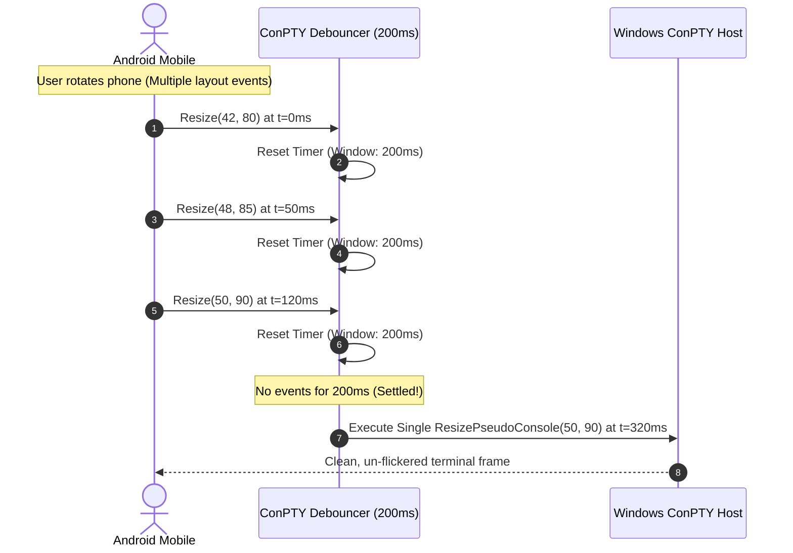

# Windows Terminal Host Agent (`apps/windows`) - Architecture & Technical Design Document
## Project: Terminal Mirror

---

### 1. Executive Summary & Platform Scope
The **Windows Terminal Host Agent** is a native, high-performance background daemon and CLI utility written in Rust, tailored specifically for the modern Windows ecosystem (Windows 10 Version 1809+ and Windows 11 on x86_64 and ARM64 architectures).

Its primary mission is to attach to or spawn a high-fidelity interactive Windows Pseudo Console (**ConPTY**) session—defaulting to PowerShell 7 (`pwsh.exe`) or Windows PowerShell (`powershell.exe`)—stream raw Virtual Terminal (VT) escape sequences, protect against the notorious ConPTY resize-redraw storm via debouncing, encrypt payloads with ChaCha20-Poly1305, and relay compressed streams to mobile clients.

---

### 2. User Experience (UX) Modes on Windows

#### Mode 1: Interactive CLI Session (Developer Default)
* Executed directly inside Windows Terminal, PowerShell, or Command Prompt:
  ```powershell
  terminal-mirror-windows.exe
  ```
* Displays an ASCII ambient status header and immediately attaches to the user's active shell session:
  ```text
  ┌────────────────────────────────────────────────────────────────────────┐
  │  ● Terminal Mirror - Windows Host Agent (ConPTY Active)               │
  │  Shell: powershell.exe     | Session: win-thinkpad-84a1               │
  │  Passphrase : [ kilo-lima-sierra-tango ]                               │
  │  Kill Switch: Ctrl + Shift + Q (Instant Revocation)                   │
  └────────────────────────────────────────────────────────────────────────┘
  ```

#### Mode 2: Windows Notification Area (System Tray Daemon)
* Executed as a background daemon:
  ```powershell
  terminal-mirror-windows.exe --tray
  ```
* Registers an icon in the Windows Taskbar Notification Area (`Shell_NotifyIcon`).
* **Context Menu Actions**:
  * Status: `ThinkPad (pwsh) - 1 Client Connected`
  * "Show Pairing QR Code" (Pops up a fluent Windows dialog)
  * "Copy Pairing Passphrase" (Copies to Windows Clipboard)
  * "Kill Remote Sessions" (`Ctrl + Shift + Q`)
  * "Exit"

#### Mode 3: Unattended Windows Service (Home Server / Dev VM)
* Can be registered as a native Windows Service via `windows-service` crate:
  ```powershell
  terminal-mirror-windows.exe --service-install
  ```
* Automatically starts on Windows boot before user login, enabling headless server mirroring.

---

### 3. ConPTY (Windows Pseudo Console) Subsystem Deep Dive

#### 3.1 Historical Evolution & ConPTY Architecture
Before Windows 10 (1809), remote terminal sharing on Windows relied on scraping the screen buffer of `conhost.exe`, which suffered from severe visual lag, missing color palettes, and broken cursor tracking.

The modern **ConPTY API** (`CreatePseudoConsole`) provides a true bidirectional VT stream:
```
┌────────────────────────┐         ┌────────────────────────┐
│  Client Shell Process  │         │  Terminal Mirror Agent │
│  (pwsh.exe / cmd.exe)  │         │     (apps/windows)     │
└───────────┬────────────┘         └───────────▲────────────┘
            │                                  │
      stdout / stderr (VT)              stdin / resize
            ▼                                  │
┌───────────────────────────────────────────────────────────┐
│              Windows ConPTY Subsystem                     │
│  • CreatePseudoConsole(COORD size, hInput, hOutput, ...)  │
│  • Manages HPCON handle & VT escape sequence translation  │
└───────────────────────────────────────────────────────────┘
```

#### 3.2 Passthrough Mode (`PSEUDOCONSOLE_PASSTHROUGH_MODE`)
On Windows 11 22H2+ (Build 22621+), Microsoft introduced flag `0x8` (`PSEUDOCONSOLE_PASSTHROUGH_MODE`):
* **Normal Mode**: ConPTY re-renders application output through its internal console buffer before producing VT sequences.
* **Passthrough Mode**: ConPTY bypasses internal buffer re-rendering, forwarding raw VT escape sequences directly. This eliminates cursor ghosting, improves rendering throughput by up to 40%, and preserves advanced color sequences.
* **Agent Strategy**: The agent inspects `RtlGetVersion`; if running on Windows 11 22H2+, it requests flag `0x8`, falling back gracefully to standard ConPTY on Windows 10.

#### 3.3 Shell Resolution Hierarchy & Execution Policies
The Windows Agent resolves shells in the following order:
1. `$env:SHELL` (if explicitly defined by developer).
2. PowerShell 7 Core: `%ProgramFiles%\PowerShell\7\pwsh.exe`.
3. Windows PowerShell: `%SystemRoot%\System32\WindowsPowerShell\v1.0\powershell.exe`.
4. Command Prompt: `%ComSpec%` (`cmd.exe`).

* **Execution Policy Guard**: When spawning PowerShell, the agent injects flags:
  `-NoLogo -ExecutionPolicy Bypass`
  ensuring developer scripts and custom prompts (Oh-My-Posh, Starship) load without policy execution errors.

#### 3.4 UTF-8 Code Page Synchronization (`CP_UTF8`)
Windows default console code page is often legacy OEM (e.g. `CP 437` or `CP 1252`).
* On startup, the agent calls:
  `SetConsoleCP(65001)` and `SetConsoleOutputCP(65001)`
  forcing full UTF-8 encoding across the pipeline.

---

### 4. The ConPTY Resize Storm Mitigation (200ms Debouncer)

#### 4.1 The ConPTY Resize Vulnerability
Calling `ResizePseudoConsole` triggers an intensive full-buffer layout recalculation and redraw burst inside Windows. If an Android user rotates their phone or the soft keyboard animates (triggering 30 resize events in 300 ms), ConPTY locks up the host CPU and floods the network.

#### 4.2 Debouncing Timing Sequence


---

### 5. Windows Power Management & Sleep Handling

* The Windows Agent handles power broadcast notifications via the Win32 window message loop:
  * **`PBT_APMSUSPEND`**: Sent immediately before Windows enters Sleep / Modern Standby. The agent dispatches a session pause notification to the relay and gracefully suspends network polling.
  * **`PBT_APMRESUMEAUTOMATIC`**: Sent when Windows wakes. The agent restores the WebSocket tunnel, triggers a `ScreenStateSync` snapshot from its `vt100` virtual grid, and resynchronizes connected Android clients.

---

### 6. Security & Credential Storage on Windows (DPAPI)

* **Credential Storage**: Paired mobile device public keys and persistent tokens are stored in:
  `%APPDATA%\terminal-mirror\authorized_devices.toml`
  encrypted using the **Windows Data Protection API (DPAPI)** via `CryptProtectData`.
* **Zero Elevation Required**: The agent executes within standard user security context and never requires UAC Administrator elevation.

---

### 7. Modular Codebase Structure (`apps/windows/src/`)

```
apps/windows/
├── Cargo.toml
├── src/
│   ├── main.rs               # Entrypoint & CLI dispatch
│   ├── config.rs             # Configuration & environment variables
│   ├── conpty/
│   │   ├── mod.rs            # ConPTY module root
│   │   ├── session.rs        # CreatePseudoConsole & HPCON lifecycle
│   │   └── shell_resolver.rs # Shell discovery (pwsh -> powershell -> cmd)
│   ├── stream/
│   │   ├── mod.rs
│   │   └── debouncer.rs      # ConPTY 200ms resize debouncer
│   └── ui/
│       ├── mod.rs
│       ├── banner.rs         # Windows console ASCII banner
│       └── tray.rs           # Optional Windows System Tray integration
```
